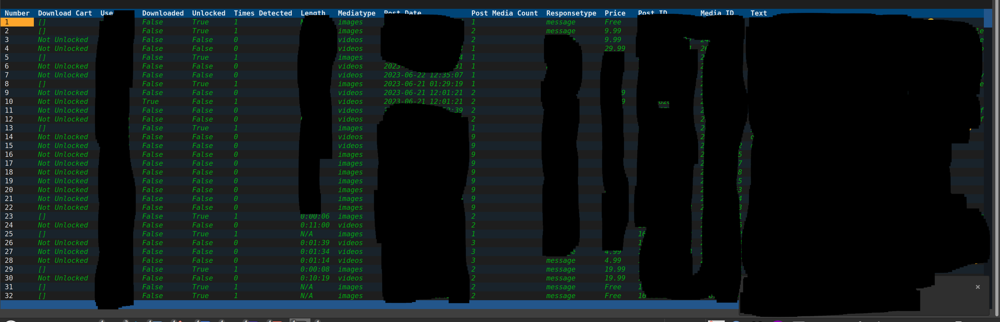

# Content Check Modes

## What is this

<figure><figcaption></figcaption></figure>

It scrapes data from OnlyFans.com, parsing the database to showcase content information via a generated table.&#x20;

Each media item occupies its own row within the table, which is searchable and offers filtering options. The table is comprehensive, containing various details for each entry

* price of content
* Will try to show if media is in your library based on media id
* If the media is unlocked
* The post that a media is connected
* Date the media was posted
* text included with the media
* Length of media


It utilizes caching to expedite processes.&#x20;

The cache is established either during regular scraping or when running in content check mode, persisting for a day before the program updates with fresh data. Additionally, you can employ '--force' to fetch the most recent information.


***

## Sorting the table

Click the column labels on the top 

* First click will be desc
* second click will be asc
* Alternates after


***

## Filtering the table


The form above contains all the filters. Clicking 'Submit' will apply the selected filters to the form

### Adding filter from table

Click on a cell to heighlight it

enter semicolon: \[ ;] or  apostrophe: \[ ' ]  the table will filter to rows matching that cell value


#### Example

The word 'videos' is highlighted\


<figure><figcaption></figcaption></figure>

Once enter semicolon: \[ ;] or  apostrophe: \[ ' ]   is pressed

only cell matching videos will appear


Furthermore, the forum will also refresh. This cycle continues until you press the reset button.

###

### Reset the table

Click on the reset button. Keep in mind, the program saves the current table information in memory, so it won't fetch new data until you restart it

###

### Example filter by all content with the text dog


###

### Additional info about text filter

Searches uses python regex

#### Searching case-senstive

Upper case trigger a case-sensitive search

```
Dog
```

#### Searching for full string match

This will prompt the search to specifically match text that is exactly "dog," rather than text that contains "dog" within it


***

## cmdline arguments

###

### Post Check Mode

This functionality is for reviewing posts on the main timeline or for paid content accessed through the post URL

1. you must add the --url or --file argument
2. You can combine the previous args
3. \--url can be split by comma or passed multiple times
4. \--file can only be passed once, and does not spit string will be interpreted as single url

#### Examples

`ofscraper post_check --url url,url,url`

`ofscraper post_check --url url --url url`

`ofscraper post_check --file file`

`ofscraper post_check --file file --url url`

#### File

Should contain accepted urls line separated

#### Accepted urls

**post page**

```
https://onlyfans.com/1113331313/model
```

**model page**

```
https://onlyfans.com/model
```

**model name**

```
model
```

**model number**

```
11131313
```

###

### Message Check Mode

To avoid redundancy, the "check mode" is equivalent to "post\_check," differing only in the accepted types of posts.&#x20;

When the cache expires all messages must be scraped again.

#### Examples

Again all the previous examples will work

`ofscraper msg_check --url url,url,url`

#### Accepted urls

**chat page**

```
https://onlyfans.com/my/chats/chat/11131313/
```

**model name**

```
model
```

**model number**

```
11131313
```

###

### Paid Check Mode

It gathers paid content using the username provided

1. you must add the --username or --file argument
2. You can combine the previous args
3. \--username can be split by comma or passed multiple times
4. \--file can only be passed once, and does not spit string will be interpreted as single username

#### Examples

```
ofscraper paid_check --username username,username
```

```
ofscraper paid_check --username username --username username
```

```
ofscraper paid_check --file file
```

```
ofscraper paid_check --file file --username username
```

#### File

Should contain usernames line separated

#### Accepted username

**model name**

```
model
```

**model number**

```
11131313
```

###

### Story Check Mode

It collects stories and highlights using the provided username

> stories are temporary content and may change frequently

1. you must add the --username or --file argument
2. You can combine the previous args
3. \--username can be split by comma or passed multiple times
4. \--file can only be passed once, and does not spit string will be interpreted as single username

#### Examples

`ofscraper story_check --username username,username`

`ofscraper story_check --username username --username username`

`ofscraper story_check --file file`

`ofscraper story_check --file file --username username`

#### File

Should contain usernames line separated

###

### Getting latest content

In each of these modes, details for each model are cached for 24 hours. To fetch the most recent content, append the "--force" argument to any of these modes.

```
ofscraper msg_check --url url --force
```
