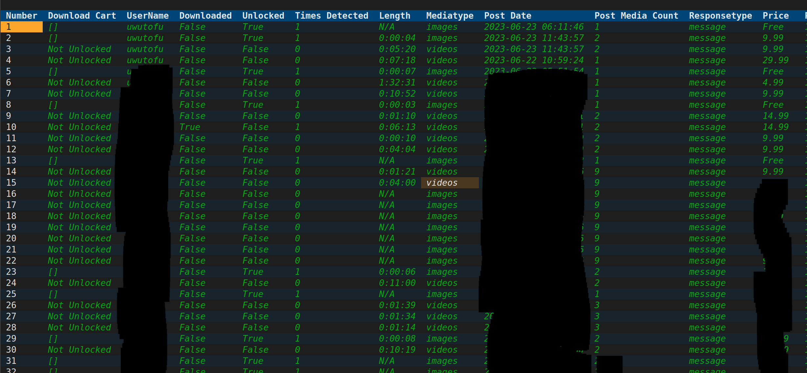

# Pre 3.10.7 filtering


**For <3.10.7**



**In new versions the filtering is no longer applied automatically**



**The top bar was also replaced with a scrollable  sidebar**


The form above contains all the filters. Clicking 'Submit' will apply the selected filters to the form

### Adding filter from table

Click on a cell to heighlight it

enter semicolon: \[ ;] or  apostrophe: \[ ' ]  the table will filter to rows matching that cell value

#### Example

The word 'videos' is highlighted\

<figure><figcaption></figcaption></figure>

Once enter semicolon: \[ ;] or  apostrophe: \[ ' ]   is pressed

only cell matching videos will appear

Furthermore, the forum will also refresh. This cycle continues until you press the reset button.
