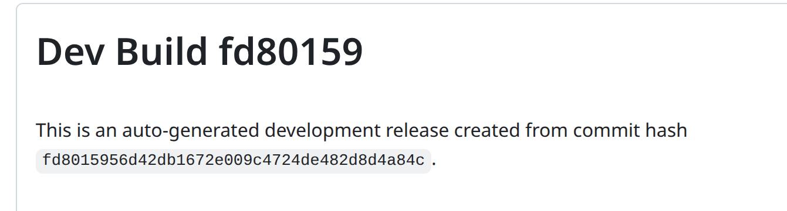

# Pre-Install Guide

## Linux

python should already be installed

## Windows

### Step 1

First step is to open your terminal program


#### Windows Terminal Program i.e command prompt



### Step 2

check if you have python installed

<figure><figcaption></figcaption></figure>

You should see something like

<figure><figcaption></figcaption></figure>

**Doesn't Work**\
Move to step 3

**Version Too old**

**If the output is not**

3.8.\*

3.9.\*

3.10.\*

Move to step 3\
\
**Every Okay**

Move to step 4

### Step 3 \[Optional Maybe]

If py -3 doesn't work you will need to install python



#### When Installing

**Make sure to install PIP**

.png>)

**Make sure to install py launcher**

.png>)

**Make sure to add to environmental variables**

### .png>)


#### Guide



#### Done

Go back to step2 and try again


## step 4

Back at the terminal type

Last step is to confirm that pip is installed

```
py -3 -m pip -V
```

It should say something like

```
pip 23.0.1 from /home/john/.local/lib/python3.10/site-packages/pip (python 3.10)

```

&#x20;

## MAC&#x20;

### Step 1

First step is to open your terminal program

#### Terminal Program




###
