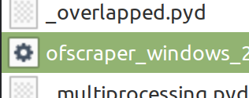

# Release Info

## Latest Pip Version

<figure><figcaption></figcaption></figure>

## Release types

.*_package

These are releases derived from commits, essentially versions that occur between numbered releases. They can be more current, but might also contain unresolved issues.

 (2) (1).png>)

numbered i.e X.X.X

These are meant to be stable releases\
 (1).png>)

## Release Files

### Example

<figure><figcaption></figcaption></figure>

###

*.zip

You can unzip these files, and the resulting folder can be used to run the script by utilizing the file starting with 'ofscraper\_' in your terminal program.&#x20;

The distinction from other releases is that startup might be slightly faster with a zip or directory since a temporary folder isn't generated each time the script begins.\
\
**Example**

.png>)

